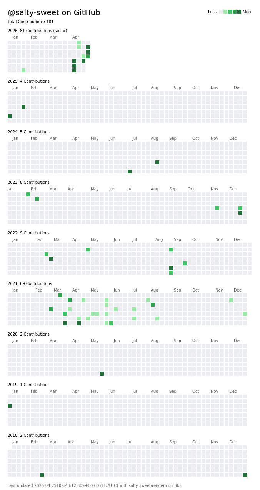

# render-contribs

A Github Action that creates an image of all your GitHub contributions, for your profile readme.

Huge thanks to [@sallar](https://github.com/sallar). This project was made after diving deep into the source code of [github-contributions-chart](https://github.com/sallar/github-contributions-chart).

```yaml
name: Render Total Contributions
on:
  push: [ branches: ["main", "dev"] ]   # run workflow after every push
  schedule: [ cron: "0 0 * * *" ]       # run daily to constantly update
  workflow_dispatch:                    # run workflow manually

jobs:
  test:
    runs-on: ubuntu-latest
    permissions:
      contents: write
    steps:
      - uses: actions/checkout@v4

      - uses: salty-sweet/render-contribs@main
        with:
          github_token: ${{ secrets.CONTRIBS_TOKEN }}
          zone: "Asia/Manila"
          theme: "dracula"
          output_path: "assets/contributions.png"
```

## EXAMPLES
| From sallar/github-contributions-chart<br>generated with https://github-contributions.vercel.app/<br>(`standard` theme) | From <a href="https://github.com/salty-sweet/">salty-sweet/salty-sweet</a><br>dynamically updates daily using **render-contribs**<br> (`dracula` theme) |
|-----|-----|
|  |  |

## HOW TO SETUP

1. ### Create a Personal Access Token for your workflow.
    > - You can generate one by going to **Settings** → **Developer Settings** → **Personal access tokens**.
    > 
    > - From there, you create a new **Fine-Grained Token**, and configure it to only have access to profile readme's repo (i.e. `salty-sweet/salty-sweet` for me). 
    > 
    > - Add the required **Permissions** by going to **Add Permissions** → **Contents**. Make sure it's set to **Read and Write**. Metadata is required by Contents, so it's an automated add by GitHub itself.
    > 
    > - Click on **Generate Token**. You'll be directed back to the previous page but now with a Fine-grained Token you have to copy.

> [!IMPORTANT]
> This is the only time you get to copy that token. If you somehow lose it along the process, redo step 1.

2. ### Add your Fine-grained Token to your Repository Secrets.
    > - Go to your profile readme repository, then go to **Settings** → **Secrets and variables** → **Actions**.
    > 
    > - Create a **New Repository Secret** and paste your copied token into the big text box. Name the secret as `CONTRIBS_TOKEN`, or however you want.
    > 
    > - Click on **Add Secret** to save it.

3. ### Enable Read and Write permissions for Github Actions bot.
    > - Still within the repository settings page, go to **Actions** → **General**. Scroll down to **Workflow Permissions**.
    > 
    > - Select **Read and write permissions**.
    > 
    > - Click on **Save** button.

4. ### Make your workflow file.
    > - Within your repository root, create **`.github/workflows/contribs.yml`** file. Copy and paste the code block from the top of this readme.
    >   
    > - If you used a custom name for your Repository Secret, find `github_token` and replace it into `${{secrets.YOUR_SECRET_TOKEN_NAME}}`.
    >
    > - Save the workflow file, commit, and push. The workflow should run and will automatically commit a new `assets/contributions.png` (or to your desired `output_path`) file into your profile readme repository.
    
> [!TIP]
> Read the **Configuration Guide** for more details on customizing this GitHub action.

5. ### Add the image file to your README.md file
    > - If you're using HTML for making your profile readme, use this line:
    > ```html
    > 
    > ```
    > 
    > - If you're using Markdown, use this instead:
    > ```md
    > 
    > ```
    >
    > - Save your profile readme file.

## CONFIGURATION
The only required configuration key for this action is `github_token`. It's required since this action's code will automatically commit the generated image into your repository. It helps in making it easier to set up especially for continuous updates.

Here are the other configuration keys and their default values.
| Key (Type) | Default Value | Description |
|------------|---------------|-------------|
| **github_token**<br>(String) | `${{secrets.CONTRIBS_TOKEN}}` | **REQUIRED!**<br>Needed for automatic collection of username and automatic commits. |
| **username**<br>(String) | *Your Username* | Specifies the specific GitHub user to collect stats from.<br><br>**Note:** You don't need this populated when generating for yourself since this action automatically acquires your username by default. |
| **theme**<br>(String) | `standard` | Theme used in rendering your contribs sheet. Preview them at https://github-contributions.vercel.app/.<br><br> The available values are:<br>`standard`, `halloween`, `teal`, `leftPad`, `dracula`, `blue`, `panda`, `sunny`, `pink`, `YlGnBu`, `solarizedDark`, `solarizedLight`. |
| **custom_theme**<br>(JSON string) | `null` | Can be used to define a custom theme! Read further below this table. |
| **output_path**<br>(String) | `assets/contributions.png` | Specifies the output path and name of your contribs sheet.<br><br>**Note:** Paths are relative to repository root. A value of `output.png` will commit the image to the project root, and will overwrite if a file exists in set path. |
| **zone**<br>(String) | `Etc/UTC` | Specifies timezone for the metadata footer. Use GMT/UTC Offsets or IANA Timezone strings. |
| **dryrun**<br>(Boolean) | `false` | Development test-thing. Only prevents the image from being committed to repository when set to true. |

### CUSTOM THEMES
render-contribs allows you to define your own color theme to use for rendering. You can do it by simply placing your desired colors into a JSON object like this one:
```jsonc
{
  "background": "#ff000000",    // Background color.
  "text": "#008888",            // Color used on title and infometric labels.
  "meta": "#227722",            // Color used on calendar labels and footer text.
  "grade0": "#ffffff",          // Color representing days without contributions.
  "grade1": "#ffdddd",          // Color representing lowest 25% of days of contributions.
  "grade2": "#ffbbbb",          // Color representing second lowest 25% of days of contributions.
  "grade3": "#ff9999",          // Color representing second highest 25% of days of contributions.
  "grade4": "#ff5555",          // Color representing highest 25% of days of contributions.
}
```
> [!IMPORTANT]
> Having `custom_theme` defined **will override and ignore** any value set to `theme` config key.

> [!TIP]
> Use hex codes for a sure way to get your colors accepted. RGBA hex codes are supported.

## CONTRIBUTING
If you've encountered bugs, issues, or any problem, feel free to file a new entry in the **Issues** tab. If you want to contribute, **Fork** this repository and submit a **Pull Request** when you're done!
